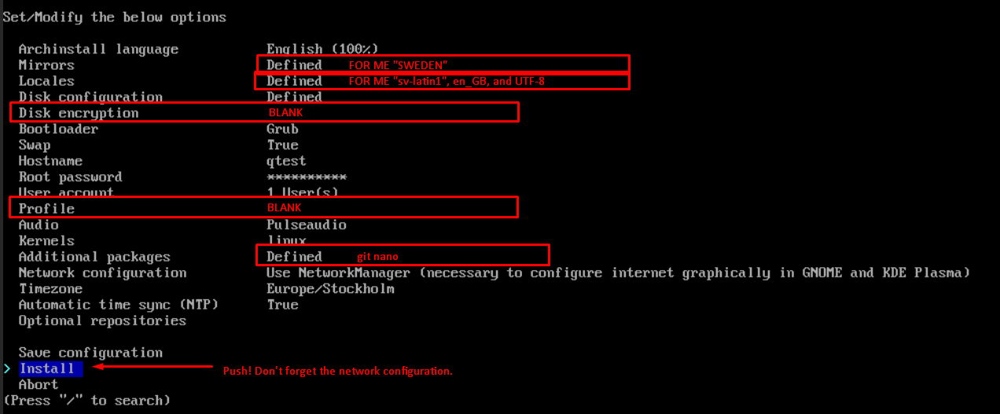

# Arch Linux Setup with dwm Installation Script
#### New Info
This might have started off being a DWM install script. . . It became more, and I had to start separating it. Which means under it's course of running, it will download the rest of the things from other repo's. 
#### Old Info
This repository contains scripts and instructions for setting up an Arch Linux system with dwm (Dynamic Window Manager) and other essential applications. It starts of installing Paru & Yay from their git repositories for access to the AUR, after that it installs the applications in the txt file applications (based on my personal needs). When it's done with that it will start downloading dwm, st, dmenu & nnn from suckless, and then flatpaks are installed. Last is to copy config files and other scripts, like adding text to .xinitrc, copying a .bashrc that has a multitude of useful alias commands pre-created. Configs (config.def.h) for dwm, st & dmenu will be copied to their folders, the old one will be renamed (confid.def.h.bak) and the command "sudo make clean install" will be used, last startx will be added to .bashrc. Other changes that will be added to the system are the change to Swedish Dvorak. If this is not to your liking there are alias commands in the .bashrc that will change to other keyboard layouts. At the end the downloaded folder will be deleted before posting that the setup is done and you can now reboot.

## Installation

Get an Arch ISO - start it and enter the command: ```archinstall```


1. **Install Git (if not already):**
   ```bash
   sudo pacman -S git
   ```
2. **Clone the Repository:**
   ```bash
   git clone https://github.com/querzion/bash.dwm-arch.startup.git
   ```
3. **Make Executable:**
   ```bash
   chmod +x -R bash.dwm-arch.startup
   ```
4. **Start:**
   ```bash
   ./bash.dwm-arch.startup/install.sh
   ```

Change the files however you like, I have it be like this because it's what I 'need' to have installed, but I will probably make separate applications, games, streaming, vm repos that is then added to this. Right now however, this is going to have to do. 
